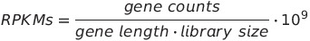

## Normalising counts
### With RPKMs
While in the previous sections the data was derived from a single sample, in this exercise we will work with the precomputed counts for all the samples in [our experiment](http://bioconductor.org/packages/2.11/data/experiment/html/pasilla.html):

```rconsole
library("pasilla")

data("pasillaGenes")
counts=counts(pasillaGenes)
head(counts)
```

A common way to normalise reads is to convert them to RPKMs (or FPKMs in the case of paired-end data). This implies normalising the read counts depending on the feature size (exon, transcript, gene model...) and on the total number of reads sequenced for that library:



**Exercise:** Let us obtain RPKMs for the table `counts` following these steps:

* Calculate the length of the exons in the `annot` object and store the result in a vector, with the name of each element set to the corresponding gene.
  *Hint:* check the *width* and *elementMetadata* accessors.

* Obtain gene lengths by adding up the lengths of all the exons in each gene.
  *Hint:* check the functions *split* and *sapply*.

* Normalise the counts by the library size.
  *Hint:* check the function *colSums*.

* Continue normalising by gene length, but be aware that the object that contains the gene lengths and the one that contains the normalised counts might have a different number of genes.

* Finally, obtain RPKMs by multiplying by a factor of 10^9.

[Solution](../solutions/_normalising_ex1.md)

Such a count normalisation is suited for visualisation, but sub-optimal for further analyses. A better way of normalising the data is to use either the *edgeR* or *DESeq* packages.

### With DESeq
RPKM normalisation is not the most adequate for certain types of downstream analysis (e.g. differential gene expression), given that it is susceptible to library composition biases. There are many other normalisation methods that should be considered with that goal in mind (see [Dillies et al. 2012](http://bib.oxfordjournals.org/content/early/2012/09/15/bib.bbs046.long) for a comparison). In this section we are going to explore the one offered within the *DESeq* package:

```rconsole
library(DESeq)

# create an object of class CountDataSet, which is the data container used by DESeq
# remember we have already loaded the pasilla dataset in the previous section
cds = newCountDataSet(counts(pasillaGenes), phenoData(pasillaGenes)$condition)
cds

# the CountDataSet class in a container for high-throughput assays and experimental metadata
# the counts can be accessed with the counts function
head(counts(cds))
# and the phenotypic data with the pData function
pData(cds)
```

In order to normalise the raw counts we will start by determining the relative library sizes, or *size factors* of each library. For example, if the counts of the expressed genes in one sample are, on average, twice as high as in another, the size factor for the first sample should be twice as large as the one for the other sample. These size factors can be obtained with the function *estimateSizeFactors*:

```rconsole
cds=estimateSizeFactors(cds)
sizeFactors(cds)
```

Once we have this information, the normalised data is obtained by dividing each column of the count table by the corresponding size factor. We can perform this calculation by calling the function counts with a specific argument as follows:

```rconsole
deseq_ncounts=counts(cds, normalized=TRUE)
```

**Exercise:** We have now accumulated three different versions of the same dataset: the raw counts (`counts`), the RPKM quantifications (`rpkm`) and the DESeq normalised counts (`deseq_ncounts`). How would you visualise the performance of each normalisation method in getting rid of the variation that does not associate to the experimental conditions that are being evaluated?
[Solution](../solutions/_normalising_ex2.md)