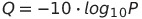

## Quality assessment (QA)
We will be using [FastQC](http://www.bioinformatics.babraham.ac.uk/projects/fastqc/) to generate our first QA report. This software can be executed in two different modes: either using the graphical user interface (if we just type `fastqc` on the terminal) or as a command itself (if we add extra parameters). For example, we can print the help documentation by typing the following:
```bash
fastqc -h
```

To generate a report for our files we only have to provide the file names as an argument:
```bash
# might take a while
fastqc SRR031714_1.fastq.gz SRR031714_2.fastq.gz
```

As a result we will obtain the file `filename_fastqc.zip`, which will be automatically unzipped in the `filename_fastqc` directory.  There we will find the QA report (`fastqc_report.html`), which provides summary statistics about the numbers of reads, base calls and qualities, as well as other information (you will find a detailed explanation of all the plots in the report in the [project website](http://www.bioinformatics.babraham.ac.uk/projects/fastqc/Help/3\%20Analysis\%20Modules/)).

**Exercise:** The information provided by the QA report will be very useful when deciding on the  options we want to use in the filtering step. After checking it, can you come up with some criteria for the filtering of our file (i.e. keeping/discarding reads based on a specific quality threshold)?
[Solution](../solutions/_qa_ex1.md)

**Exercise:** As we have seen in the previous section, fastq files contain information on the quality of the read sequence. The reliability of each nucleotide in the read is measured using the Phred quality score, which represents the probability of an incorrect base call:



where `Q` is the Phred quality value and `P` the probability of error. For example, a Phred quality score of 20 would indicate a probability of error in the base call of 1 in 100 (i.e. 99% accuracy). If you inspect the fastq file again though, you will see that this information is not displayed in number format, but is encoded in a set of characters. 
During the filtering step, we will be using tools that read these characters and transform them into quality values, so we need to be sure first about the encoding format used in our data (either phred 33 or phred 64). 
Using the information provided in the QA report (under the *per base sequence quality* section) and in the Wikipedia entry for the [FASTQ format](http://en.wikipedia.org/wiki/FASTQ_format), can you guess which encoding format was used?
[Solution](../solutions/_qa_ex2.md)

**Exercise:** As we have seen, a visual interpretation of the QA report is a very useful practice when dealing with HTS data. However, it becomes a very tedious task if we are working with huge volumes of data (imagine we have 1000 fastq files to inspect!). Thankfully, the developers of FastQC have thought of that. Can you spot any alternative output of this software that we could use in this situation?
[Solution](../solutions/_qa_ex3.md)